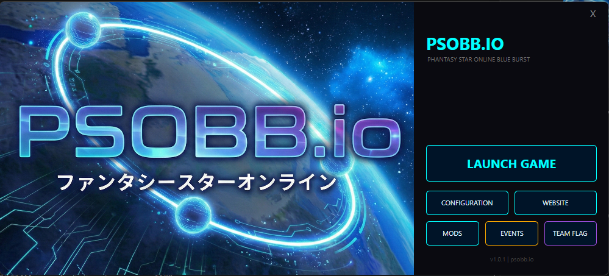

<p align="center">
  
</p>

<h1 align="center">PSOBB.IO Launcher</h1>

<p align="center">
  <strong>A modern, cross-platform game launcher for Phantasy Star Online Blue Burst</strong>
</p>

<p align="center">
  <a href="https://psobb.io">Website</a> •
  <a href="#features">Features</a> •
  <a href="#getting-started">Getting Started</a> •
  <a href="#building-from-source">Build</a> •
  <a href="#license">License</a>
</p>

---

## Features

- **One-Click Launch** — Start the game directly with automatic windowed-mode configuration.
- **Mod Manager** — Browse, download, enable, and disable community mods with thumbnail previews and local caching.
- **Configuration Panel** — Full graphics, audio, and advanced settings with registry-backed persistence (Windows) and config file support.
- **Server Events** — View upcoming in-game events pulled live from psobb.io.
- **Team Flag Tool** — Import and auto-scale any image to a 32×32 BMP team flag, ready for the game.
- **Frame Generation** — Built-in support for configuring frame interpolation and target refresh rate.
- **Gamepad Navigation** — XInput support for navigating the settings window with a controller (Windows).
- **Cross-Platform** — Built on [Avalonia UI](https://avaloniaui.net/) targeting .NET 8. Runs natively on Windows, and via Wine on macOS/Linux.

## Tech Stack

| Component | Technology |
|---|---|
| Framework | [Avalonia UI 11](https://avaloniaui.net/) |
| Runtime | .NET 8 |
| Theme | Fluent Dark with custom cosmic palette |
| Registry | `Microsoft.Win32.Registry` (Windows game settings) |
| Gamepad | XInput 1.4 via P/Invoke (Windows) |

## Getting Started

### Prerequisites

- [.NET 8 SDK](https://dotnet.microsoft.com/download/dotnet/8.0) or later

### Running

```bash
cd PsobbLauncher
dotnet run
```

> **Note:** For full functionality, place the launcher in the same directory as `psobb.exe` (or its parent directory). The launcher auto-detects the game location relative to itself.

## Building from Source

```bash
# Clone the repo
git clone https://github.com/liquidspikes/psobbio-launcher.git
cd psobbio-launcher

# Build
dotnet build

# Run
dotnet run --project PsobbLauncher
```

### Publish a Self-Contained Executable

```bash
# Windows x64
dotnet publish -c Release -r win-x64 --self-contained -o publish/win-x64

# Linux x64
dotnet publish -c Release -r linux-x64 --self-contained -o publish/linux-x64

# macOS ARM (Apple Silicon)
dotnet publish -c Release -r osx-arm64 --self-contained -o publish/osx-arm64
```

## Project Structure

```
PsobbLauncher/
├── App.axaml(.cs)              # Application entry, global styles
├── Program.cs                  # Avalonia bootstrap
├── MainWindow.axaml(.cs)       # Main launcher UI, game launch, team flag
├── SettingsWindow.axaml(.cs)   # Graphics/audio/advanced settings, gamepad input
├── ModsWindow.axaml(.cs)       # Mod browser, download, install/uninstall
├── EventsWindow.axaml(.cs)     # Live server events display
├── PSOBBIObanner.png           # Sidebar artwork
├── PSOBBIO_icon.ico            # Application icon
└── app.manifest                # DPI awareness manifest
```

## Configuration Files

The launcher reads and writes two config files in the game directory:

| File | Purpose |
|---|---|
| `widescreen.cfg` | Resolution, window mode, HUD scale, MSAA/SMAA/SSAO/HDR toggles |
| `framegen.cfg` | Frame generation toggle and target refresh rate |

Windows-specific graphics and sound settings are stored in the registry under `HKCU\Software\SonicTeam\PSOBB`.

## License

This project is open source. See [LICENSE](LICENSE) for details.

---

<p align="center">
  <sub>Built for the <a href="https://psobb.io">PSOBB.IO</a> community</sub>
</p>
